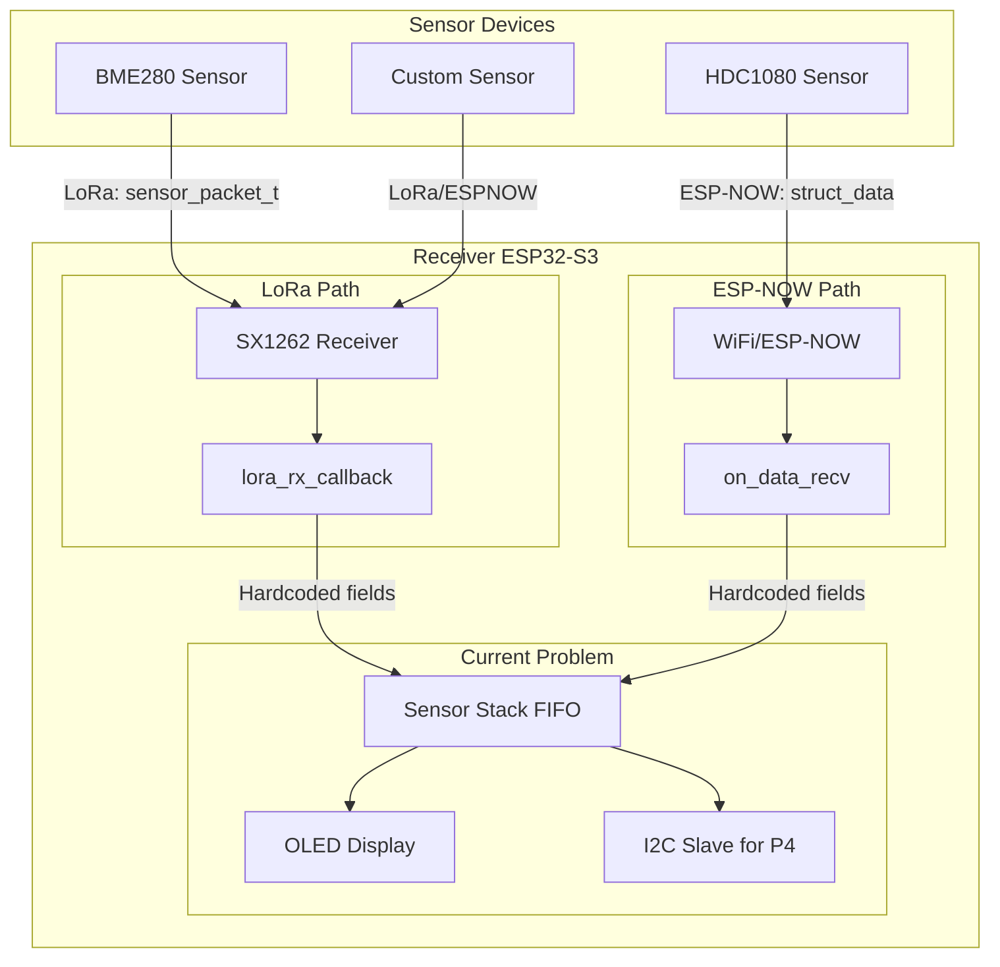
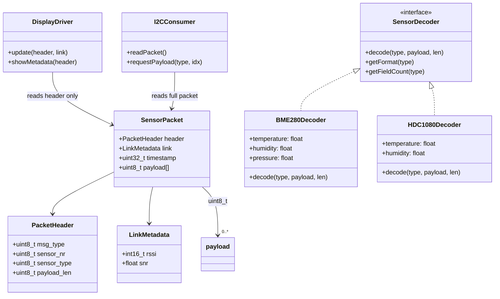
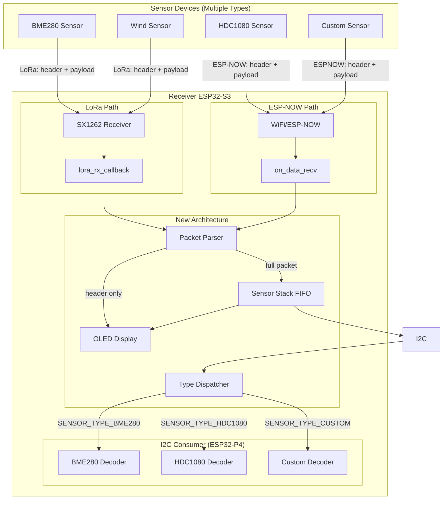

# Receiver Architecture Analysis & Refactoring Plan

## 1. Current Problem Analysis

### 1.1 Tight Coupling to Specific Sensor Data

The current architecture has a **single monolithic structure** (`sensor_packet_t`) that combines:
- **Transport metadata** (source, RSSI, SNR, timestamp)
- **Sensor identification** (sensor_nr, sensor_type)
- **Hardcoded sensor data** (temperature, humidity, pressure, voltage)

```
Current sensor_packet_t (36 bytes):
┌─────────────────────────────────────────────────────────────┐
│ msg_type  | sensor_nr | sensor_type                        │  3 bytes
├─────────────────────────────────────────────────────────────┤
│ voltage_mv                          (32 bits)               │  4 bytes
├─────────────────────────────────────────────────────────────┤
│ temperature                           (32 bits, float)      │  4 bytes
├─────────────────────────────────────────────────────────────┤
│ humidity                              (32 bits, float)      │  4 bytes
├─────────────────────────────────────────────────────────────┤
│ pressure                              (32 bits, float)      │  4 bytes
├─────────────────────────────────────────────────────────────┤
│ lora_rssi       | lora_snr      | timestamp                │  12 bytes
└─────────────────────────────────────────────────────────────┘
```

**Problem:** This structure assumes ALL sensors provide temperature, humidity, pressure, and voltage. This is fundamentally wrong because:
- A BME280 provides all three (T, H, P)
- An HDC1080 provides only T and H (no pressure)
- A DHT22 provides only T and H (no pressure)
- A wind sensor provides speed and direction
- A rain sensor provides rainfall amount
- A light sensor provides lux values

### 1.2 Data Flow Issues



**Key Issues Identified:**

| Issue | Location | Impact |
|-------|----------|--------|
| Fixed 36-byte packet size | [`lora_receiver.c:34`](main/lora/lora_receiver.c:34) | Rejects packets of different sizes |
| Hardcoded field copy | [`sensor_stack.c:36-42`](main/sensor_stack.c:36) | Wastes space, loses flexibility |
| ESP-NOW struct_data mismatch | [`network.c:23-31`](main/esp-now/network.c:23) | Different struct than LoRa packet |
| Display only shows metadata | [`display_driver.c:36-58`](main/display_driver.c:36) | Cannot show actual sensor values |
| I2C consumer gets same rigid format | [`sensor_stack.h:47-50`](main/sensor_stack.h:47) | P4 cannot adapt to sensor types |

---

## 2. Proposed Architecture

### 2.1 Design Principles

1. **Separation of Concerns**: Transport metadata is separate from sensor payload
2. **Type-Safe Dispatch**: Receiver knows *what* it received, consumer knows *how to interpret* it
3. **Variable Payload Support**: Different sensors have different data sizes
4. **Display Transparency**: Display only shows metadata, not payload content
5. **I2C Consumer Control**: ESP32-P4 decides how to interpret sensor data

### 2.2 New Data Model



### 2.3 New Packet Structure

```
New sensor_packet_t (variable, example with BME280 = 28 bytes total):

┌──────────────────────────────────────────────────────────────────┐
│ HEADER (4 bytes)                                                 │
│ ┌──────────┬───────────┬─────────────┬──────────────┐           │
│ │ msg_type │ sensor_nr │ sensor_type │ payload_len  │           │
│ │ 1 byte   │ 1 byte    │ 1 byte      │ 1 byte       │           │
│ └──────────┴───────────┴─────────────┴──────────────┘           │
├──────────────────────────────────────────────────────────────────┤
│ LINK METADATA (12 bytes)                                         │
│ ┌──────────────┬───────────┬──────────────────┐                 │
│ │ lora_rssi    │ lora_snr  │ timestamp        │                 │
│ │ 2 bytes      │ 4 bytes   │ 4 bytes          │                 │
│ └──────────────┴───────────┴──────────────────┘                 │
├──────────────────────────────────────────────────────────────────┤
│ PAYLOAD (variable, e.g., 12 bytes for BME280)                    │
│ ┌────────────────┬────────────────┬────────────────┐            │
│ │ temperature    │ humidity       │ pressure       │            │
│ │ 4 bytes float  │ 4 bytes float  │ 4 bytes float  │            │
│ └────────────────┴────────────────┴────────────────┘            │
│                                                                  │
│ For HDC1080: temperature (4B) + humidity (4B) = 8 bytes         │
│ For wind sensor: speed (4B) + direction (4B) = 8 bytes          │
└──────────────────────────────────────────────────────────────────┘
```

### 2.4 New Architecture Diagram



---

## 3. Implementation Plan

### 3.1 Phase 1: Redefine Data Structures (`sensor_stack.h`)

**Changes:**
- Split `sensor_packet_t` into:
  - `packet_header_t` (4 bytes): msg_type, sensor_nr, sensor_type, payload_len
  - `link_metadata_t` (12 bytes): lora_rssi, lora_snr, timestamp
  - `payload` (variable): raw bytes, interpreted by consumer

**New enum for payload formats:**
```c
typedef enum {
    SENSOR_PAYLOAD_NONE    = 0,   // No payload (e.g., beacon)
    SENSOR_PAYLOAD_BME280  = 1,   // temp(4) + hum(4) + press(4) = 12 bytes
    SENSOR_PAYLOAD_HDC1080 = 2,   // temp(4) + hum(4) = 8 bytes
    SENSOR_PAYLOAD_DHT22   = 3,   // temp(4) + hum(4) = 8 bytes
    SENSOR_PAYLOAD_WIND    = 4,   // speed(4) + dir(4) = 8 bytes
    SENSOR_PAYLOAD_CUSTOM  = 255, // Variable format, defined by sensor_type
} sensor_payload_format_t;
```

### 3.2 Phase 2: Update LoRa Receiver (`lora_receiver.c`)

**Changes:**
- Remove fixed size check (`len != sizeof(sensor_packet_t)`)
- Parse header to get payload_len
- Copy header + link metadata + payload separately
- Validate payload_len against known formats (or allow any)

### 3.3 Phase 3: Update ESP-NOW Receiver (`network.c`)

**Changes:**
- Replace `struct_data` with unified header + payload approach
- Sender must include payload_len in header
- Parse and forward raw payload bytes

### 3.4 Phase 4: Update Sensor Stack (`sensor_stack.c`)

**Changes:**
- Stack stores: header (4B) + link metadata (12B) + timestamp (already in link) + payload (up to MAX_PAYLOAD_SIZE, e.g., 64 bytes)
- Total max packet: 4 + 12 + 64 = 80 bytes (vs. current 36 bytes fixed)
- `sensor_stack_push()` accepts header + payload separately

### 3.5 Phase 5: Update Display Driver (`display_driver.c`)

**Changes:**
- Display only uses header + link metadata (NO payload access needed)
- Show: source, sensor_nr, sensor_type, RSSI/SNR
- Optionally show payload_len as indicator
- **Display remains unchanged regardless of sensor type**

### 3.6 Phase 6: Add I2C Decoder Framework (New Module)

**New file: `main/sensor_decoder.h/c`:**
```c
// Decoder registry pattern
typedef struct {
    sensor_payload_format_t format;
    const char* name;
    uint8_t expected_size;
    const char* fields[];  // Field names for P4 to query
} sensor_format_t;

// Register decoders for known sensor types
esp_err_t sensor_decoder_register(sensor_payload_format_t format, const sensor_format_t* fmt);

// P4 queries: "What fields does sensor type X have?"
const sensor_format_t* sensor_decoder_get_format(sensor_payload_format_t format);

// P4 reads: "Decode this payload for sensor type X"
esp_err_t sensor_decoder_decode(sensor_payload_format_t format, 
                                 const uint8_t* payload, 
                                 uint8_t payload_len,
                                 sensor_values_t* values);
```

---

## 4. File Change Summary

| File | Change Type | Description |
|------|-------------|-------------|
| [`main/sensor_stack.h`](main/sensor_stack.h) | **Modify** | Redefine `sensor_packet_t`, add payload format enum |
| [`main/sensor_stack.c`](main/sensor_stack.c) | **Modify** | Update push/pop for variable payload |
| [`main/lora/lora_receiver.c`](main/lora/lora_receiver.c) | **Modify** | Remove fixed size check, parse variable payload |
| [`main/esp-now/network.c`](main/esp-now/network.c) | **Modify** | Replace `struct_data`, use header + payload |
| [`main/display_driver.c`](main/display_driver.c) | **Modify** | Remove payload-dependent display logic |
| `main/sensor_decoder.h` | **Create** | New decoder interface |
| `main/sensor_decoder.c` | **Create** | Decoder registry and implementations |

---

## 5. Backward Compatibility Considerations

### Option A: Breaking Change (Recommended)
- Requires updating ALL sensor sender devices
- Cleanest solution, no legacy code paths
- Recommended for new deployments

### Option B: Dual-Mode Support
- Keep old 36-byte format as "compat mode"
- New variable-length format as "native mode"
- Receiver auto-detects based on packet size
- More complex, but allows gradual migration

---

## 6. Key Benefits of New Architecture

| Benefit | Description |
|---------|-------------|
| **Transparency** | Receiver doesn't care what sensor data contains |
| **Extensibility** | Add new sensor types without modifying receiver |
| **Efficiency** | No wasted bytes for unused sensor fields |
| **Type Safety** | Payload format explicitly declared in header |
| **Consumer Control** | ESP32-P4 decides how to interpret data |
| **Display Simplicity** | Display only needs metadata, never touches payload |
