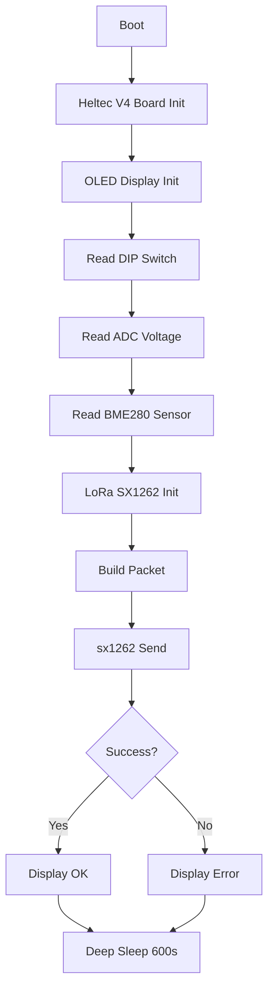

# Sensor-LORA-BME280 LoRa Conversion Plan

## Overview

Convert the Sensor-LORA-BME280 ESP32 sender from ESP-NOW to LoRa transmission. The current main.c was copied from the ESP-NOW sender and needs to be transformed to use LoRa with Heltec V4 board initialization.

## Current Architecture

```
app_main()
├── Board Init (LED blink, DIP switch, ADC, BME280)
├── ESP-NOW Network Init (NVS, WiFi, ESP-NOW, pairing)
├── Send Packet (espnow_sensor_packet_t via ESP-NOW)
└── Deep Sleep (600s)
```

## Target Architecture

```
app_main()
├── Heltec V4 Board Init (VEXT, VFEM, PA_CSD, PA_CPS)
├── OLED Display Init (SSD1306 via U8g2)
├── DIP switch, ADC voltage, BME280 sensor
├── LoRa Init (sx1262_init_bus, sx1262_init_radio, sx1262_configure)
├── Send Packet (lora_sensor_packet_t via sx1262_send)
├── Display Status (success/failure)
└── Deep Sleep (600s)
```

## Diagram



## Changes Required

### 1. Add `lora_sensor_packet_t` to packet_format.h

**File:** `../Sensor-LORA-BME280/common/packet_format.h`

Add a new packet structure after the existing `espnow_sensor_packet_t` (line 94):

```c
typedef struct __attribute__((packed)) {
    packet_header_t header;
    uint8_t payload[MAX_PAYLOAD_SIZE];
} lora_sensor_packet_t;
```

**Rationale:** This structure is identical to `espnow_sensor_packet_t` - both send header + payload only. The `link_metadata_t` is added by the receiver side when pushing to the sensor stack. Having a separate type clarifies intent and allows future differences if needed.

### 2. Rewrite main.c

**File:** `../Sensor-LORA-BME280/main/main.c`

#### 2a. Replace Includes

**Remove:**
```c
#include "esp_now.h"
#include "esp_wifi.h"
#include "nvs_flash.h"
```

**Add:**
```c
#include "nvs_flash.h"        // Keep for potential future use
#include "u8g2_esp32_hal.h"   // U8g2 HAL for display
#include "sx1262.h"           // LoRa driver
```

**Keep all existing includes** (driver/i2c_master.h, driver/gpio.h, esp_sleep.h, esp_log.h, adc, bme280, etc.)

#### 2b. Replace Constants

**Remove:**
```c
#define NVS_NAMESPACE "SENSOR"
#define MAC_VALUE "MAC"
#define CHANNEL_VALUE "CHANNEL"
#define ESPNOW_MAXDELAY 200
#define ESPNOW_QUEUE_SIZE 16
#define ESPNOW_SEND_SUCCESSFUL_BIT BIT0
#define ESPNOW_SEND_FAIL_BIT BIT1
#define ESPNOW_FIXED_CHANNEL 13
```

**Add:**
```c
// Heltec V4 FEM pins (from main_od.c)
#define PIN_VEXT     GPIO_NUM_36  // Display power (LOW = on)
#define PIN_VFEM     GPIO_NUM_7   // Amplifier power (HIGH = on)
#define PIN_PA_CSD   GPIO_NUM_2   // Chip Shut Down (HIGH = enable)
#define PIN_PA_CPS   GPIO_NUM_46  // RX/TX Path Control (HIGH = High-Power TX)

// Display pins (from main_od.c)
#define DISPLAY_SDA  GPIO_NUM_17
#define DISPLAY_SCL  GPIO_NUM_18
#define DISPLAY_RST  GPIO_NUM_21

// LoRa configuration
#define LORA_FREQUENCY    869525000  // 869.525 MHz (middle of G3 band)
#define LORA_SF           5
#define LORA_BW           LORA_BW_500
#define LORA_CR           LORA_CR_4_5
#define LORA_TX_POWER     17         // dBm
#define LORA_SYNC_WORD    0x1424     // Private network

// Status display
#define STATUS_TIMEOUT    3000       // ms for display status
```

#### 2c. Replace Board Initialization

**Remove:**
```c
static void blink() { ... }  // Simple LED blink - replace with V4 init
```

**Add (from main_od.c):**
```c
static esp_err_t init_heltec_v4(void) {
    // Configure VEXT, VFEM, PA_CSD, PA_CPS as outputs
    gpio_config_t io_conf = {
        .pin_bit_mask = (1ULL << PIN_VEXT | 1ULL << PIN_VFEM | 
                         1ULL << PIN_PA_CSD | 1ULL << PIN_PA_CPS),
        .mode = GPIO_MODE_OUTPUT,
        .pull_up_en = GPIO_PULLUP_DISABLE,
        .pull_down_en = GPIO_PULLDOWN_DISABLE,
        .intr_type = GPIO_INTR_DISABLE
    };
    gpio_config(&io_conf);
    
    // Enable display
    gpio_set_level(PIN_VEXT, 0);   // LOW = Display on
    // Enable GC1109 amplifier
    gpio_set_level(PIN_PA_CSD, 1); // HIGH = Enable
    gpio_set_level(PIN_PA_CPS, 1); // HIGH = High-Power TX
    gpio_set_level(PIN_VFEM, 1);   // HIGH = Amplifier power
    vTaskDelay(pdMS_TO_TICKS(200));
    
    return ESP_OK;
}
```

#### 2d. Add Display Initialization

**Add (adapted from main_od.c):**
```c
static esp_err_t init_display(u8g2_t* u8g2) {
    u8g2_esp32_hal_t u8g2_esp32_hal = U8G2_ESP32_HAL_DEFAULT;
    u8g2_esp32_hal.bus.i2c.sda = DISPLAY_SDA;
    u8g2_esp32_hal.bus.i2c.scl = DISPLAY_SCL;
    u8g2_esp32_hal.reset = DISPLAY_RST;
    u8g2_esp32_hal_init(u8g2_esp32_hal);
    
    vTaskDelay(pdMS_TO_TICKS(100));
    
    u8g2_Setup_ssd1306_i2c_128x64_noname_f(
        u8g2, U8G2_R0,
        u8g2_esp32_i2c_byte_cb,
        u8g2_esp32_gpio_and_delay_cb
    );
    u8x8_SetI2CAddress(&u8g2->u8x8, 0x3C << 1);
    u8g2_InitDisplay(u8g2);
    u8g2_SetPowerSave(u8g2, 0);
    
    return ESP_OK;
}

static void display_status(u8g2_t* u8g2, const char* msg, bool success) {
    u8g2_ClearBuffer(u8g2);
    u8g2_SetFont(u8g2, u8g2_font_6x10_tr);
    
    u8g2_DrawStr(u8g2, 5, 20, "Sensor ");
    // Draw sensor number
    char buf[4];
    snprintf(buf, sizeof(buf), "%d", sensor_nr);
    u8g2_DrawStr(u8g2, 45, 20, buf);
    
    u8g2_DrawStr(u8g2, 5, 35, success ? "TX OK" : msg);
    u8g2_DrawStr(u8g2, 5, 50, msg);
    u8g2_SendBuffer(u8g2);
}
```

#### 2e. Add LoRa Initialization

**Add:**
```c
static esp_err_t init_lora(void) {
    if (sx1262_init_bus() != ESP_OK) {
        ESP_LOGE(TAG, "SX1262 bus init failed");
        return ESP_FAIL;
    }
    
    if (sx1262_init_radio() != ESP_OK) {
        ESP_LOGE(TAG, "SX1262 radio init failed");
        return ESP_FAIL;
    }
    
    sx1262_config_t config = {
        .modem_mode = SX1262_MODEM_LORA,
        .frequency = LORA_FREQUENCY,
        .tx_power = LORA_TX_POWER,
        .bandwidth = LORA_BW,
        .spreading_factor = LORA_SF,
        .coding_rate = LORA_CR,
        .iq_inverted = false,
        .rx_gain_boosted = true,
        .preamble_length = 8,
        .payload_length = 0,
        .crc_on = true,
        .sync_word = LORA_SYNC_WORD
    };
    
    if (sx1262_configure(&config) != ESP_OK) {
        ESP_LOGE(TAG, "SX1262 configure failed");
        return ESP_FAIL;
    }
    
    ESP_LOGI(TAG, "LoRa configured: SF%d BW%d CR%s Power%d @ %lu MHz",
             LORA_SF, LORA_BW, LORA_CR, LORA_TX_POWER, 
             LORA_FREQUENCY / 1000000);
    
    return ESP_OK;
}
```

#### 2f. Remove ESP-NOW Functions

**Delete all of these functions:**
- `espnow_send_cb()` (lines 258-265)
- `espnow_recv_cb()` (lines 278-294)
- `espnow_init()` (lines 305-310)
- `read_peer_nvs()` (lines 324-349)
- `store_peer_nvs()` (lines 363-373)
- `delete_peer_nvs()` (lines 383-393)
- `add_peer()` (lines 406-418)
- `start_pairing()` (lines 437-466)

**Remove global variables:**
```c
static uint8_t s_broadcast_mac[ESP_NOW_ETH_ALEN] = { 0xFF, 0xFF, 0xFF, 0xFF, 0xFF, 0xFF };
static QueueHandle_t s_espnow_queue;
static EventGroupHandle_t s_espnow_event_group;
```

**Remove enum:**
```c
enum MessageType { PAIRING_REQ, PAIRING_RESP, DATA };
```

**Remove structs:**
```c
typedef struct_pairing_response { ... }
typedef struct_pairing_request { ... }
```

#### 2g. Rewrite app_main()

**Replace the network section (lines 583-647):**

```c
void app_main(){
    ++boot_count;
    ESP_LOGI(TAG, "Boot count: %d", boot_count);
    
    // 1. Initialize Heltec V4 board (FEM pins, display power)
    ESP_LOGI(TAG, "Initializing Heltec V4 board...");
    ESP_ERROR_CHECK(init_heltec_v4());
    
    // 2. Initialize OLED display
    ESP_LOGI(TAG, "Initializing OLED display...");
    u8g2_t u8g2;
    ESP_ERROR_CHECK(init_display(&u8g2));
    
    // Show starting message
    display_status(&u8g2, "Starting...", true);
    vTaskDelay(pdMS_TO_TICKS(1000));
    
    // 3. Read DIP switch
    uint8_t sensor_nr;
    ESP_ERROR_CHECK(get_sensor_number(&sensor_nr));
    ESP_LOGI(TAG, "Sensor number: %d", sensor_nr);
    
    // 4. Read ADC voltage
    uint32_t voltage = 0;
    ESP_ERROR_CHECK(get_voltage(&voltage));
    ESP_LOGI(TAG, "Voltage: %lu mV", voltage);
    
    // 5. Read BME280 sensor
    // ... (keep existing BME280 code, lines 525-581) ...
    
    // 6. Initialize LoRa
    ESP_LOGI(TAG, "Initializing LoRa...");
    ESP_ERROR_CHECK(init_lora());
    
    // 7. Build LoRa packet
    lora_sensor_packet_t packet;
    memset(&packet, 0, sizeof(packet));
    packet.header.msg_type = DATA;
    packet.header.sensor_nr = sensor_nr;
    packet.header.sensor_type = SENSOR_TYPE_BME280;
    
    // Pack payload (same as before)
    uint8_t payload_offset = 0;
    memcpy(&packet.payload[payload_offset], &voltage, sizeof(uint32_t));
    payload_offset += sizeof(uint32_t);
    memcpy(&packet.payload[payload_offset], &values_bme280.pressure, sizeof(float));
    payload_offset += sizeof(float);
    memcpy(&packet.payload[payload_offset], &values_bme280.temperature, sizeof(float));
    payload_offset += sizeof(float);
    memcpy(&packet.payload[payload_offset], &values_bme280.humidity, sizeof(float));
    payload_offset += sizeof(float);
    packet.header.payload_len = payload_offset;
    
    // 8. Send via LoRa
    ESP_LOGI(TAG, "Sending LoRa packet: %d bytes", 
             sizeof(packet_header_t) + packet.header.payload_len);
    
    esp_err_t send_err = sx1262_send((uint8_t*)&packet, 
                                       sizeof(packet_header_t) + packet.header.payload_len);
    
    // 9. Display result
    if (send_err == ESP_OK) {
        ESP_LOGI(TAG, "LoRa send successful");
        display_status(&u8g2, "TX OK", true);
    } else {
        ESP_LOGE(TAG, "LoRa send failed: %s", esp_err_to_name(send_err));
        display_status(&u8g2, "TX FAIL", false);
    }
    
    vTaskDelay(pdMS_TO_TICKS(STATUS_TIMEOUT));
    
    // 10. Enter deep sleep
    start_deep_sleep();
}
```

### 3. Update CMakeLists.txt

**File:** `../Sensor-LORA-BME280/main/CMakeLists.txt`

**Current:**
```cmake
idf_component_register(SRCS ${app_sources} 
                       INCLUDE_DIRS "."
                       REQUIRES driver freertos button sx1262)
```

**Changes:**
- Remove `button` from REQUIRES (no longer needed - no interactive menu)
- Add `u8g2` to REQUIRES (for OLED display)

**New:**
```cmake
idf_component_register(SRCS "main.c" 
                       INCLUDE_DIRS "."
                       REQUIRES driver freertos sx1262 u8g2 sensor_driver)
```

**Note:** Changed from `GLOB_RECURSE` to explicit `main.c` since we're removing lora_testtool.c and main_od.c.

### 4. Delete Temporary Files

After successful conversion and build verification:

- `../Sensor-LORA-BME280/main/main_od.c` - Heltec V4 init (code moved to main.c)
- `../Sensor-LORA-BME280/main/main_od.h` - if exists
- `../Sensor-LORA-BME280/main/lora_testtool.c` - LoRa test tool (code extracted)
- `../Sensor-LORA-BME280/main/lora_testtool.h` - LoRa test tool header

## Files to Modify

| File | Change |
|------|--------|
| `../Sensor-LORA-BME280/common/packet_format.h` | Add `lora_sensor_packet_t` struct |
| `../Sensor-LORA-BME280/main/main.c` | Complete rewrite of network section |
| `../Sensor-LORA-BME280/main/CMakeLists.txt` | Update REQUIRES, simplify SRCS |

## Files to Delete

| File | Reason |
|------|--------|
| `main_od.c` | Board init code merged into main.c |
| `main_od.h` | If exists |
| `lora_testtool.c` | Code extracted for pattern |
| `lora_testtool.h` | No longer needed |

## Build Dependencies

The project needs these components available:
- `driver` - ESP-IDF driver library
- `freertos` - FreeRTOS
- `sx1262` - LoRa radio driver (component)
- `u8g2` - OLED display library (via u8g2_esp32_hal)
- `sensor_driver` - BME280 sensor driver

## Verification Steps

1. Build the project with `idf.py build`
2. Check for compilation errors
3. Flash to device and verify:
   - Heltec V4 board initializes correctly (display turns on)
   - OLED shows "Starting..." message
   - DIP switch is read correctly
   - ADC voltage is measured
   - BME280 sensor data is read
   - LoRa configuration is printed
   - Packet is sent successfully
   - Display shows "TX OK" or "TX FAIL"
   - Device enters deep sleep after 3 seconds
